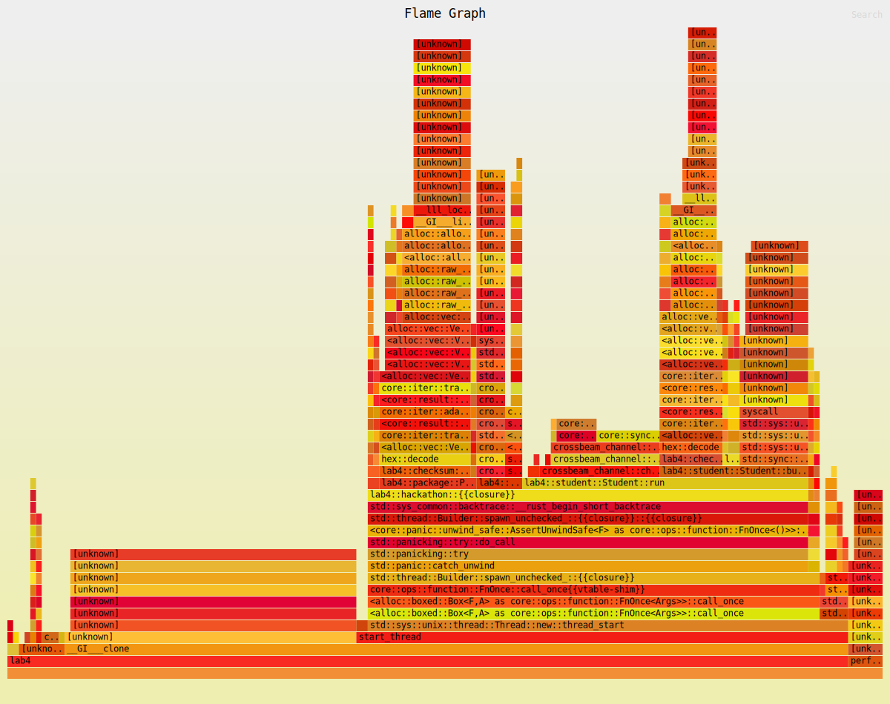

# Title

The Optimization of a Multi-Threaded Solution for a Producer-Consumer Problem

# Summary

The original solution is a multi-thread solution to a producer-consumer problem. The program works but is not optimized for performance as can be seen from the flamegraph, which clearly shows the bottlenecks as operations are not distributed evenly among threads. The modified solution contains multiple optimization (elaborated in the 'Technical details' section) which improves the performance by some **20 - 100 times**. The flamegraph for the modified solution with default parameters running on `ecetesla3` is also attached in the folder.

# Technical details

**File Read Optimization**: The original flamegraph displays a huge portion on `fs::file_read`, which is called everytime a new idea is generated or a package is downloaded, and is a huge bottleneck. The program requires the content of three files: `ideas-customer.txt`, `ideas-products.txt`, and `packages.txt` which can be read at once at the beginning of the program, performed `cross_product()` on them and stored the information in a vector for `O(1)` access time. This significantly reduces the time spent on file reading.

**Channel Splitting**: The original solution only contains one channel for all the threads to communicate on new events, which could be easily filled up. The modified solution splits the channel into three: `idea`, `pkg`, and a specialized `out_of_ideas` channel. By doing this, along with updating the logic used in student threads, the program can now process events more efficiently.

**Enhanced Student Logic**: The change in channel structure allows for a more efficient student logic. Since by design there will always be enough packages for an idea to be built, the new code would let student take one idea, and continue to take packages until the idea is built. This prevents the student to 'return' ideas or packages back to channels, reduces the complexity and results in a better performance between threads.

**Temporary Checksum Update**: By examine the flamegraph generated from the original solution, it is clear that the checksum update is a huge bottleneck due to its locking mechanism. The modified solution minimized the period for which the mutex is locked by only updating the checksum when necessary. For each idea, the intermediate checksum update is done using a local temporary variable.

**Print Statement Optimization**: The original solution would lock the `stdout` for each printing statement, which slows down the program significantly since there are a lot of printing statement. The new solution creates a thread which is responsible for all the printing jobs. Whenever a `println!()` is needed, the thread would send information to the printing thread via channels, this made sure all threads are performaning their jobs without being blocked by `stdout` locking.

# Testing for correctness

The correctness of the code is determined by comparing the checksums. The program outputs two pairs of checksums: `Idea Generator` and `Student Idea`, and `Package Downloader` and `Student Package`. The exact packages used for each ideas may be different due to multi-threading, but the checksums should be the same. As long as the checksums match and the program runs without any errors (or hangs indefinitely), the program is correct. A shell script is used for testing the correctness, which iterates through a number of input parameters and checking the checksums of the output. The script is attached in the `commit-log` folder named `test.sh` and the range of the input parameters are listed below:

```text
num_ideas: [80, 400, 800, 1000]
num_idea_gen: [2, 10]
num_pkgs: [4000, 8000, 20000]
num_pkg_gen: [6, 10, 12]
num_students: [6, 10, 20]
```

Overall, the test cases involves `4*2*3*3*3 = 216` different combinations of input parameters which the program all passed.

# Testing for performance.

The performance is tested by comparing the execution time of the original and modified solution using `hyperfine`. The test cases are the same (216 of them) as the correctness test cases. Then the speed up is calculated by `speedup = time(original) / time(modified)`. The process is automated using the same `test.sh` script. A portion of the script output is listed below. As we can see, as the test case becomes more complicated, the speedup becomes more significant. (Full output is attached in `commit-log/test_script.out`)

```text
original, modified, speedup, checksum_match, input_params(5)
...
 4.993s   53.6ms   93.2x  Match  1000  10  20000  10   6
 5.563s   54.2ms  102.6x  Match  1000  10  20000  10  10
 8.358s   65.9ms  126.8x  Match  1000  10  20000  10  20
 3.982s   51.4ms   77.5x  Match  1000  10  20000  12   6
 5.714s   53.8ms  106.2x  Match  1000  10  20000  12  10
 7.616s   65.6ms  116.1x  Match  1000  10  20000  12  20
```

Flamegraphs visualize the change as well. The original flamegraph shows multiple spikes, which indicates the bottlenecks. The optimized flamegraph shows a more even distribution of work among threads, which is the goal of the optimization. The two flamegraphs are generated with the default input parameters, when the input increases, the differences are expected to be more extreme. A comparison of the two flamegraphs is shown below:


*As we can see, the works is not evenly distributed, with the spikes(bottleneck) at `fs::read_file`, `checksum update`, and `println!`*


*The optimized flamegraph is more evenly distributed, with reduced calls to functions. The `[unknown]` on the left represents the file read at the beginning of the code, which can hardly be further optimized. It's comparion in width with `start_thread` shows how fast the multi-thread part is.*
